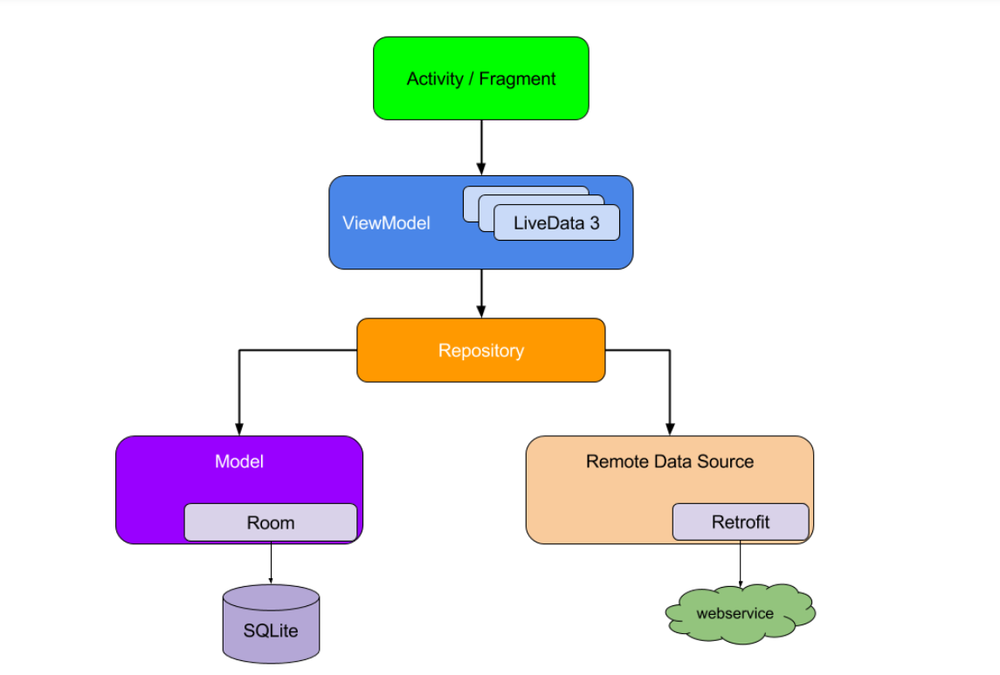

# Android project with MVVM architecture in Kotlin.

Android project developed under the architectures recommended by the google.

- Dagger
- Room DB
- LiveData
- DataBinding
- Retrofit
- Jetpack
- Repository
- ViewModel

